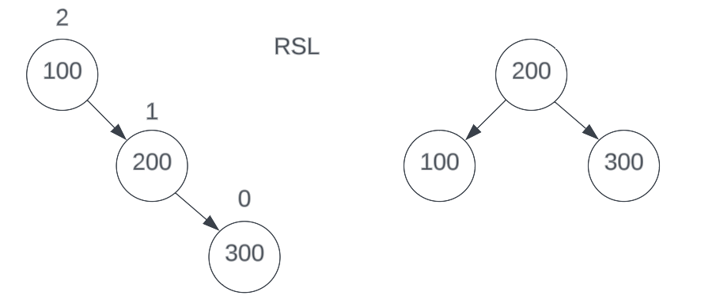
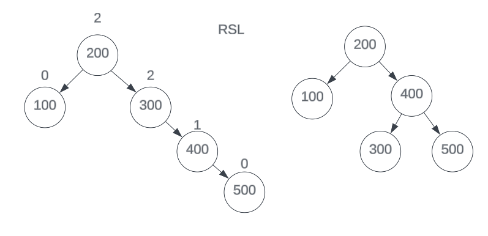
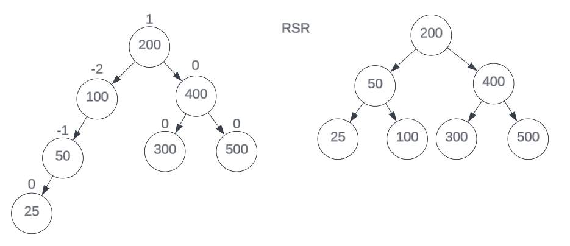
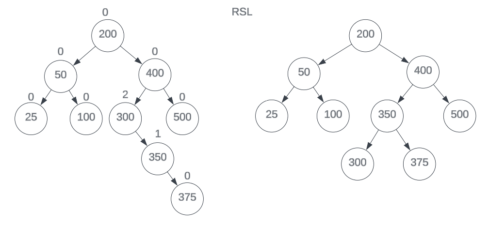
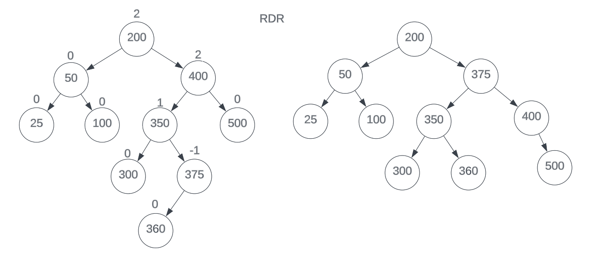
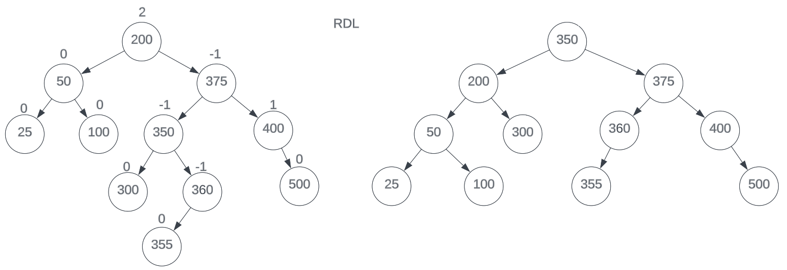
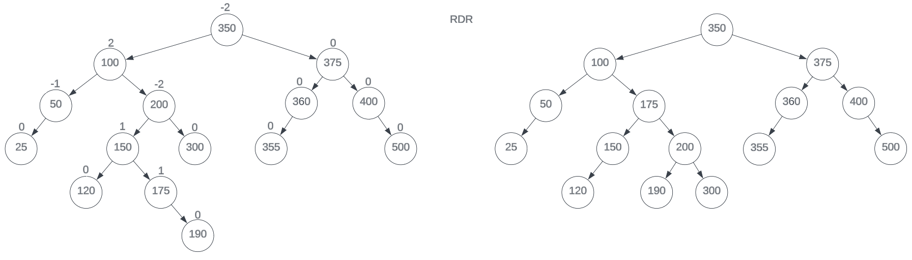

# 5.2 Operaciones de árbol AVL

- Simule las siguientes operaciones de un árbol AVL
  1. Inserción: 100 - 200 - 300 - 400 - 500 - 50 - 25 - 350 - 375 - 360 - 355 - 150 - 175 - 120 - 190.
  2. Después de crear un árbol AVL, realice la eliminación: 100 - 200 - 300 - 400 - 500 - 50 - 25 - 350 - 375 - 360 - 355 - 150 - 175 - 120 - 190.
- Para este ejercicio tienes que escribir el paso a paso del desarrollo de cada operación donde se muestra gráficamente el estado del árbol así como el factor de equilibrio para cada nodo y el tipo de operación que se está realizando, es decir, inserción, eliminación, rotación.
- Este ejercicio no requiere implementación, solo escribe el desarrollo de cada uno operación paso a paso e incluirlo en el informe.

# Resolución - Inserción

Se insertará en el siguiente orden: 100 - 200 - 300 - 400 - 500 - 50 - 25 - 350 - 375 - 360 - 355 - 150 - 175 - 120 - 190.

## 1. Elementos insertados: 100 - 200 - 300

Para empezar se insertó los primeros elementos, tras hacerlo según un BST, nos damos cuenta el factor de equilibrio del nodo raíz está en crítico, por lo tanto requerimos de hacer un RSL, una rotación simple a la izquierda.

## 2. Elementos insertados: 400 - 500

Tras insertarlos hasta que algún factor de equilibrio este en crítico, observamos que el nodo desequilibrado es el 300, por lo tanto hacemos un RSL en este.

## 3. Elementos insertados: 50 - 25

Tras insertarlos, observamos que el nodo desequilibrado es el 100, por lo tanto hacemos un RSR en este.

## 4. Elementos insertados: 100 - 200 - 300

Para empezar se insertó los primeros elementos, tras hacerlo según un BST, nos damos cuenta el factor de equilibrio del nodo raíz está en crítico, por lo tanto requerimos de hacer un RSL, una rotación simple a la izquierda.

## 5. Elementos insertados: 400 - 500

Tras insertarlos hasta que algún factor de equilibrio este en crítico, observamos que el nodo desequilibrado es el 300, por lo tanto hacemos un RSL en este.

## 6. Elementos insertados: 50 - 25

Tras insertarlos, observamos que el nodo desequilibrado es el 100, por lo tanto hacemos un RSR en este.

## 7. Elementos insertados: 100 - 200 - 300

Para empezar se insertó los primeros elementos, tras hacerlo según un BST, nos damos cuenta el factor de equilibrio del nodo raíz está en crítico, por lo tanto requerimos de hacer un RSL, una rotación simple a la izquierda.

## 8. Elementos insertados: 400 - 500

Tras insertarlos hasta que algún factor de equilibrio este en crítico, observamos que el nodo desequilibrado es el 300, por lo tanto hacemos un RSL en este.

